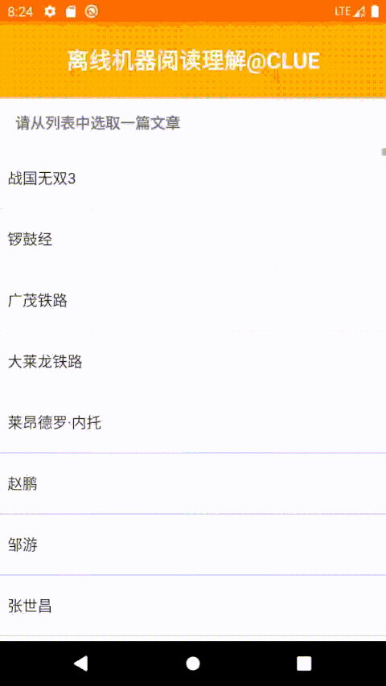

## MobileQA

[TensorFlow Lite BERT QA Android Example Application](https://github.com/tensorflow/examples/tree/master/lite/examples/bert_qa/android) 与 [tflite-android-transformers](https://github.com/huggingface/tflite-android-transformers) 展示了基于Bert/DistilBERT的离线QA例子，但是只支持英文和安卓设备。

本项目计划实现基于中文的机器阅读理解在手机端的离线应用，并且同时支持安卓和苹果设备。

Targeting to release before Dec 5th. 目标是12月5日前发布。

## 数据集

使用[CMRC 2018 公开数据集](https://github.com/ymcui/cmrc2018/blob/master/README_CN.md)，该数据集是第二届讯飞杯中文机器阅读理解评测所使用的数据。数据集已被计算语言学顶级国际会议[EMNLP 2019](http://emnlp-ijcnlp2019.org/)录用

## 模型

使用 [albert_zh_small](https://github.com/brightmart/albert_zh) 预训练模型，额外加上一层全连接做answer span预测。

* 在CMRC2018数据集的验证集上，max_seq_len为512的模型得分为F1:75.989, EM:52.097, Average:64.038，max_seq_len为384的模型得分为F1:74.781, EM:51.010, Average:62.895
* max_seq_len为512的模型使用tflite转换后大小为18M，经测试，该模型在4线程的安卓手机上推理延时为580ms左右，在单线程条件下为1.4s左右。
* max_seq_len为384的模型使用tflite转换后大小为18M，经测试，该模型在4线程的安卓手机上推理延时为390ms左右，在单线程条件下为930ms左右

* 模型训练与模型转换过程见[bert_cn_finetune-master](https://github.com/CLUEbenchmark/MobileQA/tree/master/bert_cn_finetune-master) 

## Android Demo

已完成第一版，详见 [tflite-android-transformers-master](https://github.com/CLUEbenchmark/MobileQA/tree/master/tflite-android-transformers-master) 

效果示例：

## IOS Demo

进行中

## Updates

* 2019-11-27: Add first version of Android Demo, details see [tflite-android-transformers-master](https://github.com/CLUEbenchmark/MobileQA/tree/master/tflite-android-transformers-master) 
* 2019-11-29: Add first version of MRC model, details see [bert_cn_finetune-master](https://github.com/CLUEbenchmark/MobileQA/tree/master/bert_cn_finetune-master) 

## Contribution

如果你感兴趣或希望提供帮助，发送邮件ChineseGLUE@163.com

If you're interested or want to help, send an email to ChineseGLUE@163.com

